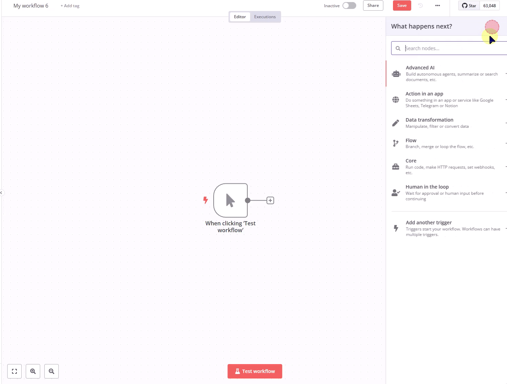

# n8n-nodes-quickemailverification

This is an n8n community node for QuickEmailVerification API. It provides email verification functionality with caching support.

[](https://buymeacoffee.com/msoukhomlinov)


*QuickEmailVerification node in action showing email verification with caching capabilities*

## Installation

Follow these steps to install the node:

```bash
# Install from npm
npm install n8n-nodes-quickemailverification

# Or install from source
npm install
```

## Features

- Email verification using QuickEmailVerification API
- Response caching with configurable TTL
- Rate limiting and retry handling
- Secure credential storage
- Remaining credits tracking
- Timestamp tracking for verifications

## Configuration

1. Get your API key from [QuickEmailVerification](https://quickemailverification.com)
2. Add your API credentials in n8n credentials manager
3. Configure optional caching settings:
   - Enable/disable caching (default: enabled)
   - Set cache TTL in days (default: 30 days)

## Usage

1. Add the QuickEmailVerification node to your workflow
2. Configure the node with your credentials
3. Connect input nodes that provide email addresses
4. Use output for email verification results

## Response Format

The node returns verification results including:
- Validation status
- Detailed reason
- Additional email information (disposable, role-based, etc.)
- MX record information
- Caching status (`cached: true/false`)
- Verification timestamp (`verifiedAt` in ISO 8601 format)
- Remaining API credits (`remainingCredits`)

Example response:
```json
{
    "result": "valid",
    "reason": "accepted_email",
    "disposable": false,
    "accept_all": false,
    "role": false,
    "free": false,
    "email": "test@example.com",
    "user": "test",
    "domain": "example.com",
    "mx_record": true,
    "mx_domain": "example.com",
    "safe_to_send": true,
    "did_you_mean": "",
    "success": true,
    "message": null,
    "cached": false,
    "verifiedAt": "2024-03-14T12:34:56.789Z",
    "remainingCredits": 950
}
```

## Error Handling

The node handles various API response codes:
- 200: Success
- 400: Bad Request
- 401: Invalid API key
- 402: Credit limit reached
- 403: Account disabled
- 404: Invalid endpoint
- 429: Rate limit exceeded
- 500: Server error

## Best Practices

1. Enable caching for frequently checked emails
2. Use batch operations for multiple emails
3. Monitor remaining credits
4. Handle rate limits with appropriate delays
5. Validate email format before verification
6. Monitor cache usage for optimal performance

## Support

If you find this node helpful and would like to support its development:

[](https://buymeacoffee.com/msoukhomlinov)

## License

[MIT](LICENSE) 
